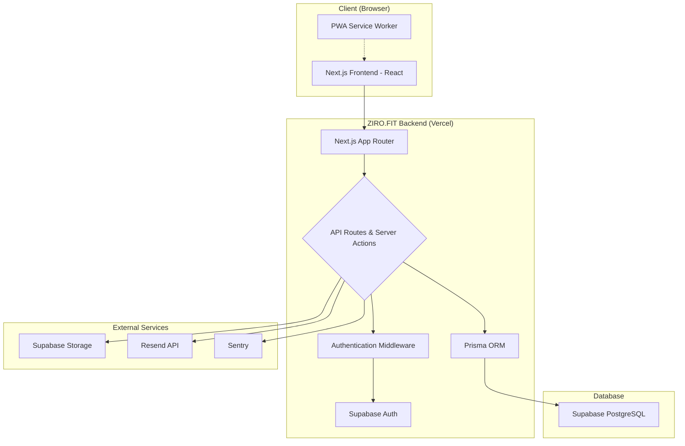

# **ZIRO.FIT: Technical Application Description**

**Version: 2.0**
**Date: October 26, 2023**

## 1. Introduction

ZIRO.FIT is a modern, full-stack SaaS marketplace built on Next.js, designed to connect personal trainers with potential clients. The platform serves as a comprehensive toolkit for trainers, enabling them to create rich, public-facing profiles, showcase their services and results, manage their client roster, and accept bookings directly through an integrated calendar system.

For clients, ZIRO.FIT offers a powerful search and discovery engine to find and book sessions with certified trainers, either in-person or online.

The application is architected to be a performant, SEO-friendly, and installable Progressive Web App (PWA), providing a seamless experience across all devices. With a mobile-first design, integrated analytics, and robust error tracking, the platform is built for real-world use and scalability.

## 2. Architectural Overview

The application follows a modern, server-centric web architecture leveraging the Next.js App Router. It uses a monolithic repository structure, containing both the public-facing marketplace and the private trainer dashboard.

**Key Flows:**
*   **User Authentication:** Handled via Supabase Auth, with session management performed by the Supabase SSR library in Next.js Middleware.
*   **Data Access:** Server Actions and API Routes use Prisma to query the PostgreSQL database. Direct database access from the client is prohibited.
*   **Public Search:** The `/trainers` page fetches data via a server-side API call that uses Prisma's advanced filtering capabilities.
*   **Booking:** The public booking form on a trainer's profile calls a Server Action, which validates availability and creates a `Booking` record in the database before triggering a notification via the Resend API.
*   **File Storage:** All user-uploaded assets (profile photos, banners) are stored securely in Supabase Storage.

## 3. Core Tech Stack

| Component | Technology |
| :--- | :--- |
| **Framework** | Next.js 14+ (App Router) |
| **Language** | TypeScript |
| **Styling** | Tailwind CSS |
| **Database** | Supabase (PostgreSQL) |
| **ORM** | Prisma |
| **Authentication** | Supabase Auth |
| **File Storage** | Supabase Storage |
| **Deployment** | Vercel |
| **Testing** | Jest, React Testing Library |

## 4. Key NPM Libraries

| Category | Library | Purpose |
| :--- | :--- | :--- |
| **Backend** | `@prisma/client` | High-performance ORM for database access. |
| | `@supabase/ssr` | Securely manages user sessions on the server. |
| | `zod` | Schema declaration and validation for all inputs. |
| | `resend` | Transactional email delivery (e.g., booking notifications). |
| **Frontend** | `react`, `react-dom` | Core UI library. |
| | `swr` | Data fetching and caching for client-side components. |
| | `chart.js` | Rendering data visualizations on the dashboard. |
| | `@heroicons/react` | Utility-first icon set. |
| | `quill`, `react-quilljs`| Rich text editor for profile content. |
| **Tooling & PWA** | `@ducanh2912/next-pwa` | Progressive Web App configuration for Next.js. |
| **Observability**| `@sentry/nextjs`| Production error and performance monitoring. |
| **Testing** | `jest`, `@testing-library/react`| Core testing framework and utilities. |
| | `jest-mock-extended`| Advanced mocking for services like the Prisma client. |

## 5. Monetization Strategy

The platform operates on a freemium model with two tiers for trainers.

*   **Free Tier:**
    *   Create and publish a profile.
    *   List up to 3 services.
    *   Upload up to 5 transformation photos.
    *   Receive bookings through the platform.
*   **Premium Tier ($19/month):**
    *   All Free Tier features.
    *   Unlimited services, photos, testimonials, etc.
    *   Priority placement in search results.
    *   Advanced analytics on profile views and bookings.
    *   Access to client management tools (session logs, measurements).

## 6. High-Level Database Schema

The schema is defined in `prisma/schema.prisma`.

*   **`User`**: Stores core user data, including role (`trainer`, `client`). Links to Supabase Auth via a UUID.
*   **`Profile`**: A one-to-one extension of `User` for all public-facing profile information (bio, photos, location, availability).
*   **`Service`, `Testimonial`, `Benefit`, `SocialLink`, `ExternalLink`**: One-to-many relations with `Profile`, storing the various content blocks for a trainer's page.
*   **`Client`**: Represents a trainer's client, with fields for contact info, goals, and health notes. Linked to a `User` (the trainer) via a nullable `trainerId`. It can also be linked to a `User` (the client themselves) via a nullable `userId`, allowing for self-management.
*   **`ClientMeasurement`, `ClientProgressPhoto`, `ClientSessionLog`**: Data models for tracking a client's journey, linked to the `Client` model.
*   **`Booking`**: Stores appointment details, linking a `User` (trainer) with client contact information.
*   **`Notification`**: Stores messages for the in-app notification center.

## 7. Epics & User Stories

### **Epic 1: User Account & Profile Management**
*   **[PROJ-001]:** As a new user, I can register for a trainer account using my email and password.
*   **[PROJ-002]:** As an existing user, I can log in and log out securely.
*   **[PROJ-003]:** As a trainer, I can access a dedicated dashboard to manage my presence on the platform.
*   **[PROJ-004]:** As a trainer, I can edit my core information (name, username, location, certifications).
*   **[PROJ-005]:** As a trainer, I can upload a profile photo and a banner image for branding.
*   **[PROJ-006]:** As a trainer, I can use a rich text editor to write my "About Me," "Philosophy," and "Methodology" sections.
*   **[PROJ-007]:** As a trainer, I can add, edit, and reorder a list of benefits of working with me.
*   **[PROJ-008]:** As a trainer, I can add, edit, and delete services I offer.
*   **[PROJ-009]:** As a trainer, I can upload and manage a gallery of client transformation photos.
*   **[PROJ-010]:** As a trainer, I can add and manage client testimonials.
*   **[PROJ-011]:** As a trainer, I can add and manage links to my social media profiles and external websites.

### **Epic 2: Public Discovery & Search**
*   **[PROJ-101]:** As a visitor, I can use a search bar on the homepage to find trainers by specialty or location.
*   **[PROJ-102]:** As a visitor, I can view a paginated search results page (`/trainers`) that lists all available trainers.
*   **[PROJ-103]:** As a visitor, I can see a preview card for each trainer in the search results, showing their photo, name, and location.
*   **[PROJ-104]:** As a visitor, I can click on a trainer's card or name to navigate to their full public profile page.

### **Epic 3: Booking & Calendar Management**
*   **[PROJ-201]:** As a trainer, I can set my weekly availability (days and times) from my profile settings.
*   **[PROJ-202]:** As a visitor on a trainer's profile, I can view an interactive calendar showing their available booking slots.
*   **[PROJ-203]:** As a visitor, I can select an available time slot and fill out a form to book a session.
*   **[PROJ-204]:** As a trainer, I receive an email notification for each new booking.
*   **[PROJ-205]:** As a trainer, I can view a list of all my upcoming and past bookings in my dashboard.

### **Epic 4: Client Management & Analytics Dashboard**
*   **[PROJ-301]:** As a trainer, I can view a dashboard with at-a-glance statistics (active clients, sessions this month).
*   **[PROJ-302]:** As a trainer, I can see charts on my dashboard visualizing client progress and my monthly activity.
*   **[PROJ-303]:** As a trainer, I can add, edit, and delete clients in a dedicated client management section.
*   **[PROJ-304]:** For each client, I can log measurements, progress photos, and session notes.
*   **[PROJ-305]:** As a trainer, I can see a real-time activity feed of recent events (new bookings, new measurements, etc.).
*   **[PROJ-306]:** As a trainer, I can view an in-app notification center for important updates.

### **Epic 5: Mobile Experience & PWA**
*   **[PROJ-401]:** As a user on a mobile device, I can navigate the trainer dashboard using a fixed bottom navigation bar.
*   **[PROJ-402]:** As a user on any device, all pages and components, including data charts, are fully responsive and legible.
*   **[PROJ-403]:** As a user, I can "install" the ZIRO.FIT application to my home screen for an app-like experience.

### **Epic 6: Client Self-Service & Data Sharing**
*   **[PROJ-501]:** As a new user, I can register for a "Client" account.
*   **[PROJ-502]:** As a client, I can log my own workout sessions in a dedicated dashboard.
*   **[PROJ-503]:** As a client, I can view my progress charts based on the data I logged.
*   **[PROJ-504]:** As a client browsing a trainer's profile, I can choose to share my data with them.
*   **[PROJ-505]:** As a client, I can see which trainer I am currently sharing data with.
*   **[PROJ-506]:** As a client, I can stop sharing my data with a trainer at any time.
*   **[PROJ-507]:** As a trainer, when adding a new client, I am notified if a user with that email already exists.
*   **[PROJ-508]:** As a trainer, I can see an indicator on my client list for clients who have linked their user accounts.

## 8. Development & Compliance Practices

*   **Schema Validation:** All server-side data mutations and form submissions are strictly validated using **Zod** schemas to ensure data integrity and security.
*   **Component Architecture:** The application leverages the Next.js App Router, using **Server Components** for data fetching and static rendering, and **Client Components** (`"use client"`) for interactivity.
*   **SEO:** The application is highly optimized for search engines, with dynamic sitemap generation (`sitemap.ts`), `robots.ts`, canonical URLs, and rich structured data (JSON-LD) on key pages.
*   **Error Tracking:** The application is integrated with **Sentry** for comprehensive, real-time error tracking and performance monitoring in production environments.
*   **Testing:** The codebase includes a comprehensive test suite using **Jest** and **React Testing Library**. Tests cover critical UI components and, most importantly, server-side business logic in server actions and API services to prevent regressions.
*   **Responsive Design:** All user interfaces are built with a **mobile-first** approach using Tailwind CSS to ensure a seamless experience on all screen sizes.
*   **Code Quality:** The project uses ESLint and Prettier to enforce a consistent and high-quality coding style.

## 9. Future Scope & Roadmap Ideas

*A parking lot for ideas to be considered post-launch.*

-   Direct payment processing for booked sessions via Stripe.
-   Full 2-way synchronization with Google Calendar & Outlook Calendar.
-   Dedicated client accounts for managing bookings and viewing progress.
-   In-app messaging between trainer and client.
-   B2B offering for gyms to manage all their trainers under one account.

## post mwp 
 - /trainers page has filter and sorting, trainers reviews and stars.
 - clients can sign in as clients to measure themselves
 - sharable measurements between individual client and showing the result to trainer.
 - integration with google calendar 
 - notification with new booking 
 - changable language 

## **ZIRO.FIT: Post-MVP Future Features & Roadmap**

This document outlines potential future enhancements for the ZIRO.FIT platform, designed to increase user value, drive revenue, and build a strong community.

### **Tier 1: High-Impact Features (Next 6-12 Months)**

These features are designed to significantly improve the core product offering and directly support the Premium Tier monetization strategy.

#### **Epic 6: Advanced Client Management & Communication**

*   **Goal:** Transform the platform from a booking tool into a comprehensive client relationship management (CRM) system for trainers.
*   **User Stories:**
    *   **[PROJ-501] Client Login & Portal:** As a client, I can log in to a dedicated portal to view my upcoming sessions, past logs, and progress shared by my trainer.
    *   **[PROJ-502] In-App Messaging:** As a trainer, I can send and receive direct messages with my clients through the platform, keeping all communication centralized.
    *   **[PROJ-503] Program Builder:** As a Premium trainer, I can create multi-week workout programs (e.g., "6-Week Shred") with scheduled workouts and assign them to my clients.
    *   **[PROJ-504] Shared Files & Resources:** As a trainer, I can upload and share documents (like meal plans or exercise guides) directly with a specific client.

#### **Epic 7: Monetization & Subscription Management**

*   **Goal:** Implement the full payment and subscription lifecycle and introduce new revenue streams.
*   **User Stories:**
    *   **[PROJ-601] Stripe Integration for Subscriptions:** As a trainer, I can securely enter my payment information and subscribe to the Premium Tier via a Stripe Checkout page.
    *   **[PROJ-602] Trainer Subscription Management:** As a Premium trainer, I can view my current subscription status, see my next billing date, and cancel my subscription from my dashboard.
    *   **[PROJ-603] Feature Gating:** As a developer, the system correctly restricts access to Premium features (e.g., advanced analytics, unlimited services) for Free Tier users.
    *   **[PROJ-604] (Optional) Per-Session Payments:** As a trainer, I can optionally require clients to pay for a session upfront via Stripe at the time of booking.

### **Tier 2: Platform Expansion & Community Building**

These features aim to increase the platform's "stickiness" by fostering a community and making the trainer profiles more dynamic.

#### **Epic 8: Community & Content Features**

*   **Goal:** Evolve ZIRO.FIT from a utility into a destination for fitness content and interaction.
*   **User Stories:**
    *   **[PROJ-701] Trainer Blogging:** As a Premium trainer, I can write and publish articles (e.g., "Top 5 Nutrition Tips") on my profile, which are also discoverable on a central ZIRO.FIT blog.
    *   **[PROJ-702] Profile Reviews & Ratings:** As a client who has completed a session, I can leave a public star rating and a review on my trainer's profile.
    *   **[PROJ-703] "Ask a Trainer" Q&A Forum:** As a visitor, I can ask a general fitness question in a public forum, and verified trainers can answer, boosting their visibility.

#### **Epic 9: Advanced Discovery & Profile Enhancement**

*   **Goal:** Improve the discovery engine and allow trainers to showcase more of their expertise.
*   **User Stories:**
    *   **[PROJ-801] Advanced Search Filtering:** As a visitor, I can filter search results by price range, trainer rating, gender, and specific specializations (e.g., "Post-natal," "Kettlebell").
    *   **[PROJ-802] Video Introductions:** As a trainer, I can embed a YouTube or Vimeo video on my profile to serve as a personal introduction.
    *   **[PROJ-803] Geolocation Search:** As a visitor, I can use my browser's location to automatically find trainers "near me".

### **Tier 3: Long-Term & Scalability Features**

These features are aimed at long-term growth, data-driven insights, and expanding the platform's technical capabilities.

#### **Epic 10: Data & Analytics**

*   **Goal:** Provide trainers with actionable insights to grow their business.
*   **User Stories:**
    *   **[PROJ-901] Advanced Profile Analytics:** As a Premium trainer, I can view detailed analytics on my profile, including page views, traffic sources, booking conversion rates, and search appearances.
    *   **[PROJ-902] Client Progress Reporting:** As a trainer, I can generate a PDF report of a client's progress (weight chart, photos) to share with them.

#### **Epic 11: Platform Integrations & API**

*   **Goal:** Position ZIRO.FIT as a central hub in a trainer's digital ecosystem.
*   **User Stories:**
    *   **[PROJ-1001] Google Calendar Sync:** As a trainer, I can connect my Google Calendar to automatically block off busy times in my ZIRO.FIT availability and have new bookings pushed to my calendar.
    *   **[PROJ-1002] Public API for Partners:** As a developer, I can access a read-only public API to embed a trainer's booking widget on a third-party website (e.g., the trainer's personal blog).
